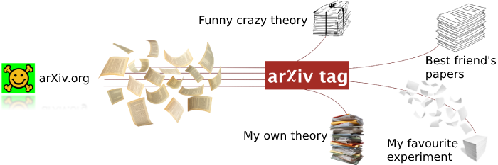

[](https://gitlab.com/suvorov21/arxivtagpy/-/commits/master)
[](https://gitlab.com/suvorov21/arxivtagpy/-/commits/develop)

[](https://www.codacy.com/manual/suvorov21/arxivtagpy?utm_source=gitlab.com&amp;utm_medium=referral&amp;utm_content=suvorov21/arxivtagpy&amp;utm_campaign=Badge_Grade)
[](https://www.codacy.com/gl/suvorov21/arxivtagpy/dashboard?utm_source=gitlab.com&utm_medium=referral&utm_content=suvorov21/arxivtagpy&utm_campaign=Badge_Coverage)

[](https://sonarcloud.io/dashboard?id=suvorov21_arxivtagpy)
[](https://sonarcloud.io/dashboard?id=suvorov21_arxivtagpy)


# arXiv tag
Welcome to [arXivtag.com](https://arxivtag.com)!

A server and a [web-page](https://arxivtag.com) for friendly monitoring of the paper submissions at [arXiv.org](https://arxiv.org/).



### Main features:
1. Create **tags with rules for keywords in title, abstract, and author list**. One can use logical operators (or/and/negation), regular expressions, and TeX formulas. The paper feed is sorted based on your preferences. View the most interesting papers on top!
2. Papers suitable with a given tag are **bookmarked automatically**.
3. Email notifications are sent when the paper suitable with a given tag is submitted.
4. Add any number of arXiv sections and further toggle them easily with check boxes. Control paper novelty (new/updated) and papers from the cross-categories with the checkboxes as well.
5. Select a date range of submissions: today/this week/this month/**since your last visit**. Check easily what submissions you have been already overviewed.
6. Dark and light theme of the website.
7. Authorization with ORCID

Detailed features description and screenshot gallery at [arxivtag.tk](https://arxivtag.tk)

## Support project

Project maintaining requires some amount of coffee and money for server hosting.
If you like the project, your support is welcome.

[](https://www.paypal.com/donate/?hosted_button_id=LQKRDE4T6NU4G)

## Development

### Docker run

To run server locally with Docker, build and run the image with

```bash
docker-compose build && docker-compose up
```

The website is accessible with a browser at `http://0.0.0.0:8000/`

The bulk paper download for the last month could be triggered with 
`curl -L -X POST "http://0.0.0.0:8000/load_papers?token=test_token"`


### Python venv

Server can be run without Docker, just with a system python and postgres. The python3 >= 3.6 is required.

To do so, create the virtual environment
```bash
python3 -m venv varxiv
. varxiv/bin/activate
pip install -r requirements.txt
```

The Postgres DB should be installed. The DB can be created with

```bash
flask db init; flask db migrate; flask db upgrade
```

The front-end is build with npm

```bash
cd app/frontend/src/
npm install
npm run build
```

The server can be run in the dev mode with

```bash
flask run
```

The website access is the same as for the Docker run.

